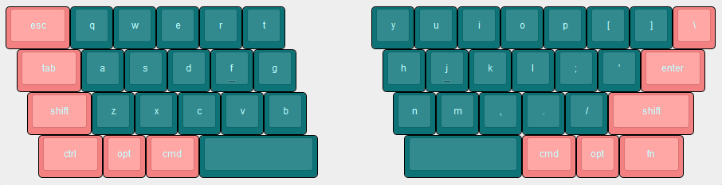

# hummingbird

my first keyboard design. who knows if this is going to work out!

the hummingbird is a 47 key, uniformly staggered keyboard with a staircase shaped split following along the stagger.

the name comes from the tetris setup known as the [hummingbird](https://harddrop.com/wiki/Hummingbird).

- [x] layout
- [ ] case
- [ ] pcb

## log

### may 7th 2020

this design has been on my mind for a little while now. i'm trying not to have
any majorly lofty ideas, but i can't help but want to do something special even though
it probably won't turn out the way i envision it.

i've created the [layout](http://www.keyboard-layout-editor.com/#/gists/c454188f723c2345890526e3a30fd868)
as well as a first revision of a case. i have hit the point where i think i need to design a pcb
to get further with the case, however; i'm quite inspired by [plaid](https://github.com/hsgw/plaid) and the likes
with only through hole components, and i'd like to try and make something similar for this one.

so here i am with a git repo and an empty kicad project! wish me luck i guess.
